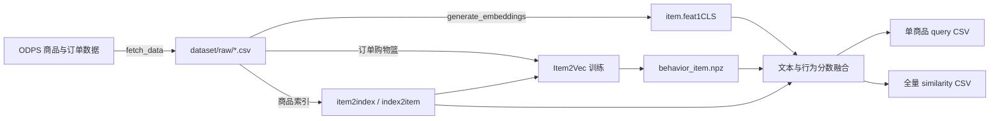

# Item2Vec 文本与行为融合召回

本项目使用 M3E/BERT 生成商品文本向量，使用 Item2Vec 生成订单共现行为向量，并在推理阶段融合两路余弦相似度，用于相似商品召回。所有流程通过 `scripts/` 下的 Bash 脚本执行，Python 实现位于 `src/item2vec/`。

## 项目结构

```text
scripts/fetch_data.sh              从 ODPS 获取商品与订单数据
scripts/generate_embeddings.sh     生成商品文本向量和商品索引
scripts/train.sh                   训练 Item2Vec 行为向量
scripts/query_similar.sh           查询单个商品的相似商品
scripts/export_similarities.sh     批量导出所有商品的相似结果
scripts/run_pipeline.sh            依次执行取数、文本向量生成和行为训练
src/item2vec/data_fetch.py         ODPS 查询与 CSV 导出
src/item2vec/embedding.py          M3E/BERT 文本向量生成
src/item2vec/training.py           购物篮构建与 Item2Vec 训练
src/item2vec/inference.py          文本和行为分数融合与结果导出
src/item2vec/io.py                 模型、向量和商品索引读写
dataset/raw/                       环境配置与 ODPS 原始 CSV
dataset/m3e-base/                  本地预训练文本模型
dataset/downstream/                商品索引、向量和相似度结果
tests/                             数据、训练、推理和脚本测试
```

## 数据契约

### 商品数据

`dataset/raw/item.csv` 用于建立统一商品索引并生成文本向量：

| 字段 | 含义 | 使用方式 |
| --- | --- | --- |
| `prod_id` | 商品 ID | 去重后建立 `item2index.json` 和 `index2item.json` |
| `prod_description` | 商品文本描述 | 输入 M3E/BERT 文本编码器 |

同一 `prod_id` 出现多次时保留第一条商品描述。文本向量与商品索引的行顺序必须一致。

### 订单行为数据

`dataset/raw/order_item.csv` 用于训练行为向量：

| 字段 | 含义 | 使用方式 |
| --- | --- | --- |
| `order_id` | 订单 ID | 定义一个训练购物篮的边界 |
| `user_id` | 用户 ID | 由取数结果保留，当前训练不直接使用 |
| `prod_id` | 商品 ID | 映射到统一商品索引 |
| `dt` | 订单日期 | 作为必填数据字段进行校验 |

训练会对同一订单内的商品去重，并按商品索引排序。含 2 至 `MAX_BASKET_SIZE` 个不同商品的订单进入训练；超过上限的订单会被排除。单商品订单不产生训练商品对，但仍会计入该商品的订单数。

## 环境与目录

项目要求 Python 3.9 或更高版本。建议在虚拟环境中安装依赖：

```bash
python -m pip install -r requirements.txt
```

将 M3E-base 模型放入 `dataset/m3e-base/`，并从模板创建 ODPS 配置文件：

```bash
cp dataset/raw/.env.example dataset/raw/.env
```

`dataset/raw/.env` 使用以下配置：

```dotenv
ALI_ACCESS_ID=your_access_id
ALI_SECRET_ACCESS_KEY=your_secret_access_key
ALI_PROJECT=your_project
ALI_ENDPOINT=https://your-maxcompute-endpoint/api
```

前三项必填。`ALI_ENDPOINT` 可选，省略时使用代码中的杭州 VPC 默认地址。凭据、原始 CSV、模型文件和下游产物均为本地运行资产，不应提交到版本库。

流水线使用固定目录：

```text
dataset/
├── raw/
│   ├── .env
│   ├── item.csv
│   └── order_item.csv
├── m3e-base/
└── downstream/
    ├── item2index.json
    ├── index2item.json
    ├── item.feat1CLS
    ├── behavior_item.npz
    ├── query_<ITEM_ID>.csv
    └── item_similarity_<mode>.csv
```

## 完整流程

执行完整训练流水线：

```bash
bash scripts/run_pipeline.sh
```

执行顺序固定为：`fetch_data → generate_embeddings → train`。任一阶段失败，脚本会立即停止。完整流水线训练完成后结束，不自动执行相似度查询或批量导出。

训练完成后批量导出每个商品的 Top-20 相似商品：

```bash
bash scripts/export_similarities.sh 20 512 hybrid
```

查询单个商品：

```bash
bash scripts/query_similar.sh ITEM_ID 10 hybrid
```

### 使用 nohup 后台执行

耗时较长时可以用 `nohup` 包装完整流水线或任一阶段：

```bash
mkdir -p logs
nohup bash scripts/run_pipeline.sh > logs/pipeline.out 2>&1 &
echo $!
```

重新连接后执行 `tail -f logs/pipeline.out` 查看日志。`nohup` 只能避免进程因 SSH 会话断开而退出，不能防止机器重启、任务超时、OOM 或节点故障。不要同时对同一目录执行相同阶段，否则可能并发写入同名文件。

## 数据流与输出



`behavior_item.npz` 包含行为向量 `vectors`、商品 ID `item_ids`、商品订单数 `order_counts` 和训练配置 `metadata`。文件写入后会先验证内容，再通过原子替换发布。没有有效行为信号的商品使用零向量，并在推理时回退到文本相似度。

查询与批量导出的 CSV 使用相同字段：

| 字段 | 含义 |
| --- | --- |
| `master_prod_id` | 当前查询或主商品 ID |
| `slave_prod_id` | 召回的相似商品 ID |
| `similarity` | 文本与行为融合后的余弦相似度 |

## 各阶段 Bash 命令与参数

所有命令均从项目根目录执行：

```bash
PROJECT_DIR=/path/to/item2Vec
cd "$PROJECT_DIR"
```

### 1. fetch_data：从 ODPS 获取数据

#### 执行命令

```bash
bash scripts/fetch_data.sh
```

#### 配置与输出

| 配置 | 是否必填 | 默认值 | 说明 |
| --- | --- | --- | --- |
| `ALI_ACCESS_ID` | 是 | 无 | ODPS Access ID |
| `ALI_SECRET_ACCESS_KEY` | 是 | 无 | ODPS Access Key |
| `ALI_PROJECT` | 是 | 无 | ODPS Project |
| `ALI_ENDPOINT` | 否 | 杭州 VPC Endpoint | ODPS 服务地址 |

脚本固定读取 `dataset/raw/.env`，查询最近 30 个日历日的订单数据，并输出 `dataset/raw/item.csv` 和 `dataset/raw/order_item.csv`。

### 2. generate_embeddings：生成商品文本向量

#### 执行命令

```bash
bash scripts/generate_embeddings.sh
```

#### 前置文件与输出

| 类型 | 路径 | 说明 |
| --- | --- | --- |
| 输入 | `dataset/raw/item.csv` | 必须包含 `prod_id,prod_description` |
| 输入 | `dataset/m3e-base/` | 本地 M3E/BERT 模型目录 |
| 输出 | `dataset/downstream/item2index.json` | 商品 ID 到向量行号 |
| 输出 | `dataset/downstream/index2item.json` | 向量行号到商品 ID |
| 输出 | `dataset/downstream/item.feat1CLS` | 768 维 float32 文本向量 |

脚本自动选择 CUDA 或 CPU。文本以每批 4 条、最大 512 Token 编码，并取模型的 CLS 向量。

### 3. train：训练行为向量

#### 默认训练

```bash
bash scripts/train.sh
```

#### 自定义训练参数

```bash
bash scripts/train.sh 128 30 15 10
```

四个位置参数必须同时提供：

| 位置 | 参数 | 默认值 | 说明 |
| --- | --- | --- | --- |
| 1 | `VECTOR_SIZE` | `128` | 行为向量维度，必须为正整数 |
| 2 | `MAX_BASKET_SIZE` | `30` | 允许进入训练的最大购物篮大小 |
| 3 | `NEGATIVE` | `15` | SGNS 负采样数量 |
| 4 | `EPOCHS` | `10` | 训练轮数 |

`MIN_ORDER_COUNT` 环境变量默认为 `5`，控制商品参与行为训练所需的最小订单数：

```bash
MIN_ORDER_COUNT=8 bash scripts/train.sh
```

训练使用固定的全购物篮 SGNS，并将结果写入 `dataset/downstream/behavior_item.npz`。

### 4. query_similar：查询单个商品

#### 执行示例

```bash
bash scripts/query_similar.sh ITEM_ID 10 hybrid 0.7
```

#### 可执行参数

```text
bash scripts/query_similar.sh ITEM_ID [TOPK [RECALL_MODE [TEXT_WEIGHT]]]
```

| 位置 | 参数 | 是否必填 | 默认值 | 说明 |
| --- | --- | --- | --- | --- |
| 1 | `ITEM_ID` | 是 | 无 | 要查询的商品 ID |
| 2 | `TOPK` | 否 | `10` | 返回的相似商品数量 |
| 3 | `RECALL_MODE` | 否 | `hybrid` | `similar`、`complement` 或 `hybrid` |
| 4 | `TEXT_WEIGHT` | 否 | 模式默认值 | 文本基础权重，范围为 0 至 1 |

结果写入 `dataset/downstream/query_<ITEM_ID>.csv`。文件名中的不安全字符会替换为下划线。

### 5. export_similarities：批量导出相似商品

#### 执行示例

```bash
FULL_CONFIDENCE_ORDERS=50 \
  bash scripts/export_similarities.sh 20 512 complement 0.3
```

#### 可执行参数

```text
bash scripts/export_similarities.sh [TOPK [BLOCK_SIZE [RECALL_MODE [TEXT_WEIGHT]]]]
```

| 位置 | 参数 | 是否必填 | 默认值 | 说明 |
| --- | --- | --- | --- | --- |
| 1 | `TOPK` | 否 | `10` | 每个商品导出的相似商品数量 |
| 2 | `BLOCK_SIZE` | 否 | `512` | 每批计算的主商品数量 |
| 3 | `RECALL_MODE` | 否 | `hybrid` | `similar`、`complement` 或 `hybrid` |
| 4 | `TEXT_WEIGHT` | 否 | 模式默认值 | 文本基础权重，范围为 0 至 1 |

结果写入 `dataset/downstream/item_similarity_<mode>.csv`。`BLOCK_SIZE` 只控制分块计算规模，不改变相似度结果。

### 推理模式、权重与订单置信度

三种召回模式提供不同的基础权重：

| 模式 | 文本基础权重 | 行为基础权重 | 用途 |
| --- | ---: | ---: | --- |
| `similar` | `0.85` | `0.15` | 更重视文本语义相似 |
| `complement` | `0.20` | `0.80` | 更重视订单共现行为 |
| `hybrid` | `0.60` | `0.40` | 平衡文本和行为，默认模式 |

位置参数 `TEXT_WEIGHT` 或同名环境变量会覆盖模式的文本基础权重。`FULL_CONFIDENCE_ORDERS` 是商品行为信号达到满置信所需的订单数，默认值为 `50`。

每个商品的行为置信度为：

```text
商品置信度 = min(商品订单数 / FULL_CONFIDENCE_ORDERS, 1)
```

商品对取两件商品中较低的置信度，最终权重为：

```text
实际行为权重 = (1 - TEXT_WEIGHT) × 商品对置信度
实际文本权重 = 1 - 实际行为权重
最终相似度 = 实际文本权重 × 文本相似度 + 实际行为权重 × 行为相似度
```

例如文本基础权重设为 `0`，满置信订单数为 `50`。商品 A 有 10 单，商品 B 有 80 单，则商品对置信度为 `0.2`，最终仍使用 `0.8` 的文本权重和 `0.2` 的行为权重。只有两件商品都达到 50 单时，才完全使用行为相似度。任一商品缺少有效行为向量时，该商品对完全回退到文本相似度。

推理相关环境变量如下：

| 环境变量 | 默认值 | 说明 |
| --- | --- | --- |
| `RECALL_MODE` | `hybrid` | 未提供对应位置参数时使用 |
| `TEXT_WEIGHT` | 模式默认值 | 未提供对应位置参数时使用 |
| `FULL_CONFIDENCE_ORDERS` | `50` | 行为信号达到满置信所需的订单数 |

环境变量可以与位置参数组合使用：

```bash
RECALL_MODE=similar \
FULL_CONFIDENCE_ORDERS=80 \
  bash scripts/export_similarities.sh 20 512
```

位置参数的优先级高于同名环境变量。
